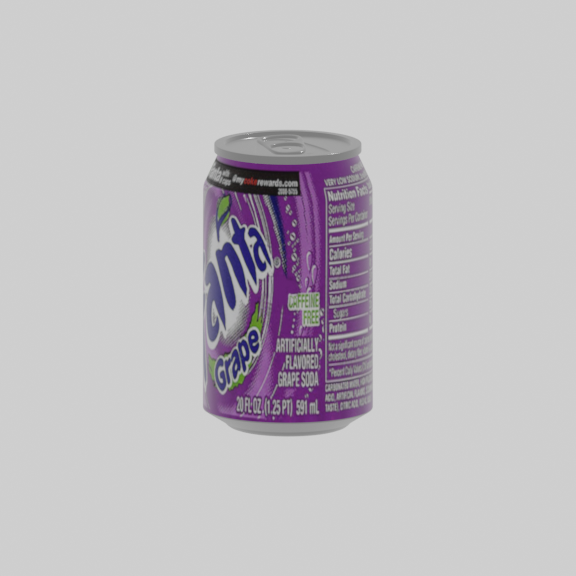
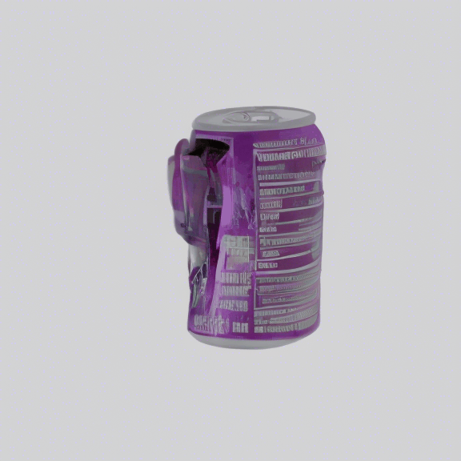
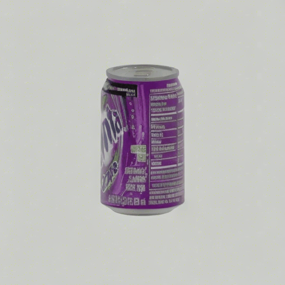
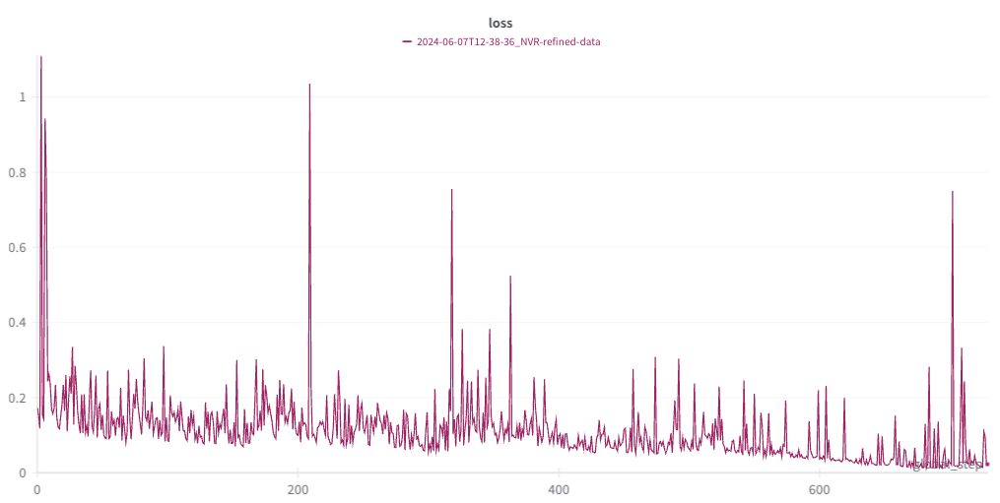

# SV3D fine-tuning
Fine-tuning code for SV3D

<table align=center>
  <tr>
    <th style="text-align:center;">Input Image</th>
    <th style="text-align:center;">Before Training</th>
    <th style="text-align:center;">After Training</th>
  </tr>
  <tr>
    <td style="text-align:center;"></td>
    <td style="text-align:center;"></td>
    <td style="text-align:center;"></td>
  </tr>
</table>

## Setting up

#### PyTorch 2.0

```shell
conda create -n sv3d python==3.10.14
conda activate sv3d
pip3 install -r requirements.txt
```

#### Install `deepspeed` for training
```shell
pip3 install deepspeed
```

## Get checkpoints 💾
Store them as following structure:
```
cd SV3D-fine-tuning
    .
    └── checkpoints
        └── sv3d_p.safetensors
```

## Dataset 📀
Prepare dataset as following.
We use Objaverse 1.0 dataset with preprocessing pipeline.
See [objaverse dataloader](https://github.com/briankwak810/objaverse_dataloader) for detail.
`orbit_frame_0020.png` is input image, and `video_latent.pt` is the video latent encoded by SV3D encoder, without regularization (i.e. channel is 8)
```
cd dataset
    .
    └── 000-000
    |   └── orbit_frame_0020.png # input image
    |   └── video_latent.pt # video latent
    └── 000-001
    |   └── orbit_frame_0020.png
    |   └── video_latent.pt
    └── ...
```


## Training 🚀
I used a single A6000 GPU(VRAM 48GB) to fine-tune.
```shell
sh scripts/sv3d_finetune.sh
```
<p align=center>
    
</p>

## Inference ❄️
Store the input images in `assets`
```shell
sh scripts/inference.sh
```

## Acknowledgement 🤗
The source code is based on [SV3D](https://github.com/Stability-AI/generative-models).
Thanks for the wonderful codebase!

Additionally, GPU and NFS resources for training are supported by [fal.ai](fal.ai)🔥.

Feel free to refer to the [fal Research Grants](https://fal.ai/grants)!
